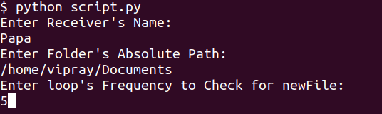
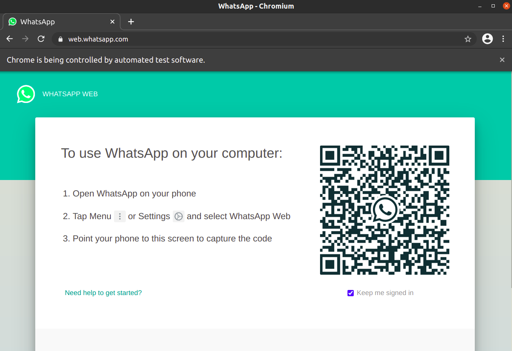

# New FileToWhatsapp
Python script to automatically send new files (in folder) to a contact (or group) on Whatsapp

### Installation Requirement:
1. Install selenium (pip install selenium)
2. Download Chrome driver (https://chromedriver.storage.googleapis.com/index.html?path=2.36/)
    You also need to pass the path of 'chromedriver'. For simplicity you can put it in the same folder where script.py resides.
3. Chromium Web Browser (sudo apt-get install chromium-browser)

### Step1(Inputs):
1. Contact(or Group name) to whom you want to send the file.
2. Absolute Path of the folder you need to track
3. Frequency of tracking the folder

### Step2(Open Web Whatsapp):
Open Your Whatsapp on the Web whatsapp page in the Chromium Browser's instance
(Instance will open automatically after the step1)

### Step3(Let the Script Handle from here):
1. It will find the Contact(or Group name) {may take time if name is deep in the list}
2. Open that chat box
3. Attach the file
4. Send it.
5. Repeat :)

#### Development Environment:
Python 3.7.6

Ubuntu 20.04.2 LTS (64-bit)

#### UseCases:
1. To share live logs of under development application with the team members.

#### References:
1. https://medium.com/data-science-community-srm/whatsapp-automation-with-selenium-a4fbaff625a0
2. https://www.geeksforgeeks.org/whatsapp-using-python/
